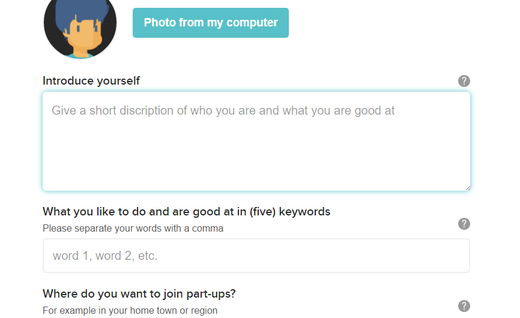
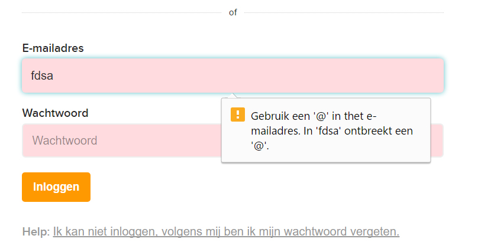
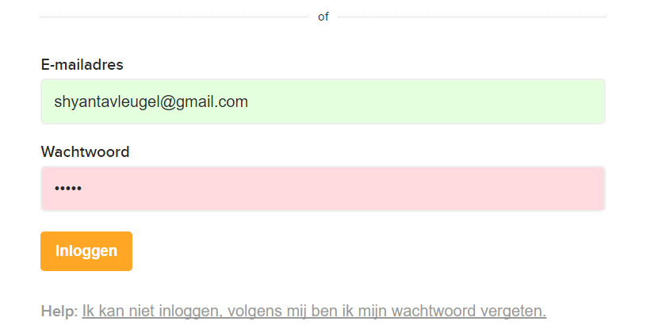
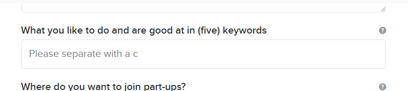
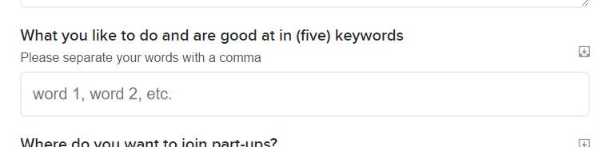
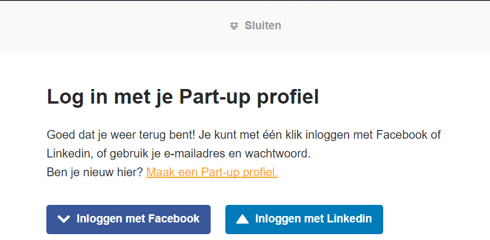

# Part-up Form Demo's

## Introduction of the project
The main goal of this project is to improve the part-up site. This can be performance
wise. Or maybe change the accessibility of the website. This so the website can be used by anyone
and everywhere. Even if you don't have great sight, caused by the weather or maybe because you're
blind or partially blind. Also the connection matters, when you're sitting in the train and you're
using the train wifi, you can bet the connection won't be very good. You want your users to be able
to access your site, no matter what the connection is. Therefore it's important to improve the
performance of your website. Make some parts work offline or at least make it as fast as possible on a
bad connection.

## What did I do?
I decided to focus on a small part of the site that can use some improvements. I'm making demo's of the
login and register forms on the website. These parts can be improved on multiple points. First the forms
aren't accessible with the <kbd>tab</kbd> key. The `:focus` styles are brought to a minimum, so even when tabbing
through the forms, you have no idea where you are navigating to. Also a lot of requirements for the input
fields are placed in the placeholder. When the users types inside this field, the placeholder will be
deleted. The user has no idea what the requirements are, when he starts to type. It's important to place
information like this inside a label.

Also I made sure that the basis form that is needed, still can be used on older browsers. However,
when the user uses a newer browsers, he may see that there are some extra functions on the form.
The form will be progressive enhanced. Newer browsers will render a validation style, this provides
visible feedback when the right content is entered. So when an email contains an at sign, the field
will be seen as valid.

All the changes I made for the styling are done in a seperate stylesheet. This sheet is called `edited-style.css`.
And it can be found [here for login](login/css/edited-style.css) and [here for register](register/css/edited-style.css).
In the HTML files, I only added the form code and nothing more, the functionality of the Facebook or
LinkedIn will not work in this demo. This because the demo is focused the working of the form pages only.

## How did I do this?
### Accessibility
#### Outline Styles
To improve the accessibility I added focus styles and maintained a right flow for the <kbd>tab</kbd> key navigation.
The original CSS changed all the focus styles to `#ffffff` so the weren't visbile. For each element
that should be reached with the <kbd>tab</kbd> key, I will add a focus style that is clearly visible.



#### Tab-index and autofocus
I deleted the autofocus attribute from the form. This because the autofocus will disturbe the flow
for the people that work with screen readers. These people expect the first focus to be in the top-left.<br>
When you use autofocus, this flow will be interrupted and blind people will have no idea that they
aren't at the first tab of the page. You can use `tab-index` to manipulate the <kbd>tab</kbd> order.
This way all the tabable items will still be in the tab flow. And the user will not start inbetween them. (source 1)

### User Experience

#### Novalidate Attribute
I saw that there was a `novalidate` attribute added to the form. Be sure to add these things
with javascript only. When javascript won't work in the browser, because an error occcured or
javascript is turned off, the form won't handle the required attributes. Therfore it won't validate
the form. HTML only can handle this form, so even with the worst connections, the form will validate. <BR>
If you want to validate based on your own javascript and not with HTML validation, don't add the
`novalidate` attribute in the HTML directly, but add it through your javascript. So when the
javascript won't work, the validation will.


#### Validate feedback
To give the user some visible feedback I added the `:valid` styles. This way the user is sure
that they entered their email or password in the right way. You can do this by simply making
the background color green, or something similar. The same way you can use `:invalid` to add a
red background, when the input isn't valid. This is visual confirmation to the form. It won't work
in the older browsers, especially in IE9 or lower. But without these styles, the form will still work.<br>
This is why this will be seen as progressive enhancement. If your browser supports, you will see a
form that will have more functionality.<br>
The email field in the form had a `input[type="text"]` attribute, but this is an email, I
changed this to email, so the form validation will work the right way.

```
input[type="password"]:valid,
input[type="email"]:valid {
	background-color: #e4ffdd;
}
input[type="password"]:invalid,
input[type="email"]:invalid {
	background-color: #ffdbdf;
}
```

#### Labels vs placeholders
A lot of requirements of the input field, are explained in the placeholder. This is not the meaning
of a placeholder. Since the placeholder disappears when the users starts typing in the input, you
can't place the important information there. The important information should be placed inside your
label. And in the placeholders you can place an expample, that shows the users what you it is, that
that you want from them, based on the requirements.<br>
Also the register form contains a input field, where you have to enter five words about what you're
good at. The placeholder reads "Please seperate with a c".

```
<div class="autoform-tags-field">
	<input type="text" class="js-input" data-schema-key="tags_input" style="display: none;"><div class="bootstrap-tagsinput"><input type="text" placeholder="Please separate with a comma" style=""></div>
</div>
```
In the code you can see that they want you to separate with a comma, but every user will see this
and will think that they want you to seperate with the letter <kbd>C</kbd>. Of course this will
sound weird. What if you want to enter a word that has a <kbd>C</kbd> in it, can you still add that word,
do you have to come up with another word that doesn't contain a <kbd>C</kbd>? This is the perfect
example to show that you have to place this information inside a label, and place an example in
the placeholder.

HTML:
```
<span class="pu-label">
	What you like to do and are good at in (five) keywords
	<span class="label-required">Please separate your words with a comma</span>

	<div class="autoform-tags-field">
		<input type="text" class="js-input" data-schema-key="tags_input" style="display: none;"><div class="bootstrap-tagsinput"><input type="text" placeholder="word 1, word 2, etc." style=""></div>
	</div>
```
CSS:
```
span.label-required {
	font-size: .8em;
	font-weight: normal;
	color: #555;
	margin-top: 8px;
	display: inline-block;
	width: 90%;
}
```

### Neseccary changes
When I copied the CSS and HTML from the original site to make a demo, there were some errors that
I had to solve. Those errors are about the icon fonts. I loaded every font that's on the original
site. But the icons that were loaded, got other icons. So the code that had to be a 'times', became
a dropbox icon on my demo. I replaced the icons with SVG icons. On the original site, that piece of
code isn't neseccary to add to the original site.<br>

```
.picon-times::before,
.picon-facebook::before,
.picon-linkedin::before {
	content: "";
	display: inline-block;
	height: 16px;
	width: 16px;
	line-height: 20px;
	background-size: 16px;
}
.picon-facebook:before {
	background-image: url(../img/facebook.svg);
}
```
This is a problem that occurs more often than you think. This may be a reason to lose the icon fonts
and start using svg's. You are sure that every user will see the same icon, and see an icon. In stead
of the empty space (``) that occurs when the icon font coudn't be loaded. If you want the SVG to work
perfectly you have use it inline, and not as an before element(I didn't do this because I had to overwrite the icon fonts). When it's an inline svg element, you can style it in anyway you want. Give it al the colors and the icon will always look sharp. (source 2)


## Sources
1. [Is automatically assigning focus bad for accessibility?
](http://stackoverflow.com/questions/2180645/is-automatically-assigning-focus-bad-for-accessibility)
2. [Inline SVG vs Icon Fonts](https://css-tricks.com/icon-fonts-vs-svg/)
